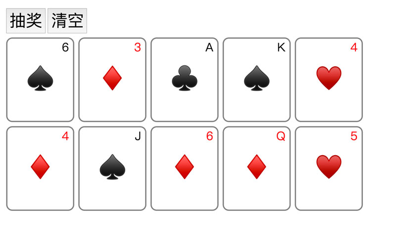
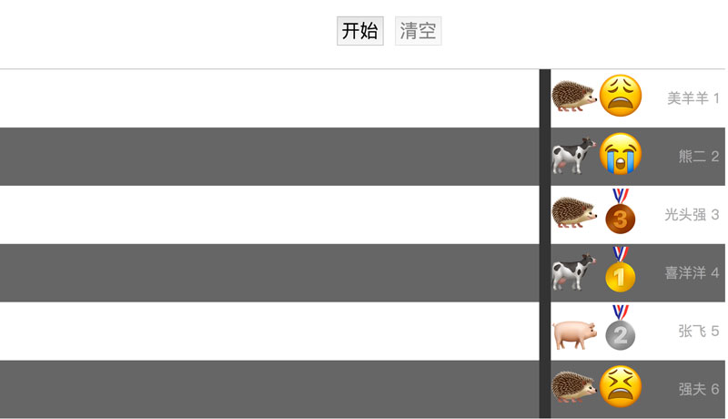

# 抽奖程序

奇舞团有个传统，每年年会现场由[月影](https://github.com/akira-cn)现场写一个抽奖程序，所有人一起review代码，以确保抽奖程序算法没有问题，然后组织抽奖。

这个项目是奇舞团历年抽奖程序实现的开源版本。

由于2017年之前的代码找不到了（囧），所以现在只有两个版本，但是2019年和2020年的玩法已经想好了，敬请期待，嘿嘿嘿~

## 2017年会抽奖

## 2018年会抽奖

